[//]: # (TeamName: IRM Performance Tracker)
[//]: # (Member1: Ismael Brea Arias::ismael.brea@udc.es)
[//]: # (Member2: Ruben González Ouzounis::ruben.gonzalez.ouzounis@udc.es)
[//]: # (Member3: Manuel Valiña Pérez::manuel.valina.perez@udc.es)
[//]: # (Teacher: Alonso Rodríguez Iglesias)
<!-- Si quereis hacerle un logo (con IA o como prefirais) ya es lucirse y queda muy bien :) -->


# IRM Performance
<p align="justify">
El proyecto IRM Performance Tracker consiste en el desarrollo de una aplicación web bajo el framework Django que permite analizar el rendimiento de equipos y jugadores de fútbol mediante el uso de Python en el lado del servidor. El sistema integrará datos en tiempo real consultados a APIs externas, para transformar estadísticas brutas en indicadores de valor. Toda la aplicación se desplegará utilizando contenedores de Docker y se gestionará mediante control de versiones en Git, asegurando un entorno de ejecución profesional y colaborativo.
</p>

<p align="justify"> El núcleo de la propuesta consiste en un comparador estadístico entre dos equipos de una competición, implementado mediante la librería Pandas. Esta se encarga de realizar una limpieza rigurosa de los datos y de calcular métricas clave, como la probabilidad de victoria de cada equipo a partir de sus estadísticas. Además, se presentarán tablas con los máximos goleadores, asistentes y jugadores con mayor número de infracciones (calculadas en función de tarjetas amarillas y rojas), con el objetivo de ofrecer una visión detallada del rendimiento de los deportistas. La aplicación incluirá también una sección dedicada a cada equipo de la liga seleccionada, donde se mostrará información básica, la localización de su estadio mediante un mapa y tablas con su posición en la clasificación, así como el listado de jugadores junto a sus nacionalidades. Por otro lado, se dispondrá de una pantalla de partidos para cada competición, que permitirá consultar resultados de jornadas pasadas y acceder a los horarios de los encuentros futuros de la temporada. Asimismo, se han integrado cuotas de casas de apuestas para los partidos aún no disputados. Finalmente, el backend desarrollado con Django gestionará una base de datos de usuarios que permitirá la personalización de ligas y equipos favoritos.

</p>

## Vistas

## APIs utilizadas


## Listado de las funcionalidades

### F1. Selección de liga:
Permite al usuario seleccionar una liga desde un menú anclado a la izquierda.

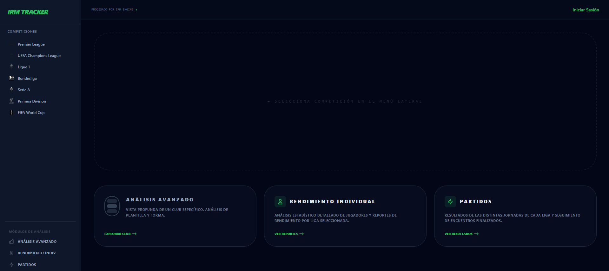


Una vez seleccionada la liga aparecería el comparador de equipos.

### F2. Selección de equipos:

 Permite seleccionar dos equipos pertenecientes a la liga elegida, validando que no sean iguales. La selección se puede llevar a cabo mediante un dropdown o mediante un buscador de texto que filtra en función de coincidencias de cadenas de caracteres. 

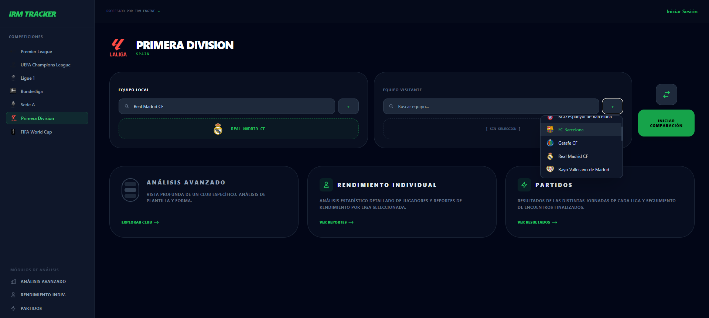


### F3. Estimación de probabilidad de resultado:

 Genera una predicción basada en las estadísticas calculadas. Calcula usando Pandas la probabilidad de victoria de un equipo respecto al otro basándose en ciertas métricas ofrecidas por la API. La fórmula de probabibilidad la calculamos de la siguiente manera:
 35% puntos liga + 25% ataque + 15% defensa + 15% forma reciente + 5% porterías a cero + 5% efectividad
 
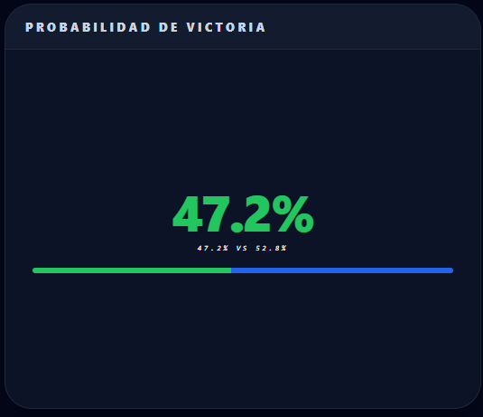

### F4. Comparativa de métricas basadas en el rendimiento reciente y muestreo mediante gráfico de barras

 Muestra una comparación entre dos equipos basada en sus datos recientes. Muestra los siguientes datos de cada equipo en la competición seleccionada:

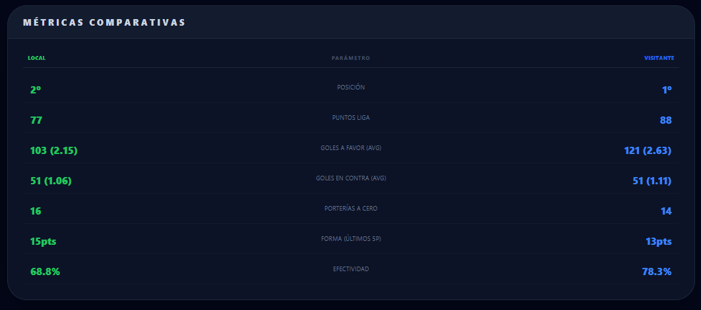

- Posición
- Puntos
- Goles a favor
- Goles en contra
- Porterías a cero
- Partidos empatados
- Partidos perdidos

 Por otro lado, mostramos un gráfico de barras mediante **Plotly.js** que muestra la comparativa de las métricas previamente descritas, facilitando una visión clara de las diferencias entre ambos equipos.

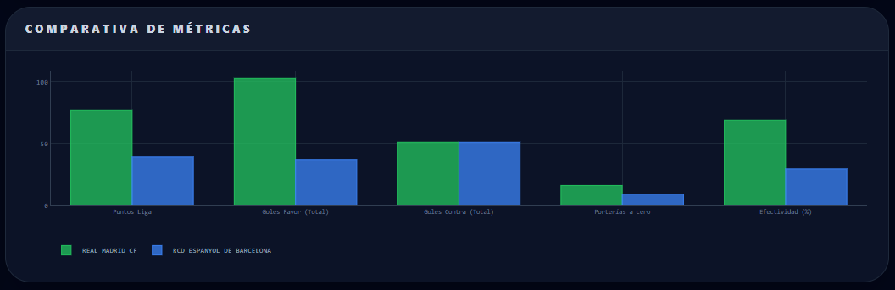


### F5. Gráficas de líneas de forma reciente de los dos equipos: 

Permiten identificar patrones específicos de rendimiento de forma visual. Para ello, empleamos una gráfica de líneas mediante **Plotly.js** que representa los cinco últimos resultados de cada equipo en todas las competiciones (solo aquellas que nosotros mostramos, si juegan por ejemplo Europa League o Copa del Rey no se mostrarán): el valor superior (3 puntos) indica victoria, el intermedio empate y el inferior derrota.

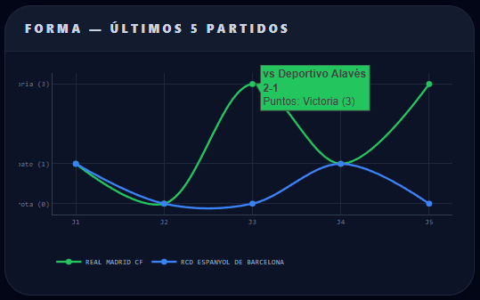


### F6. Últimos resultados entre los dos equipos

Se muestran los enfrentamientos más recientes entre los dos equipos seleccionados, considerando únicamente las competiciones disponibles en la web. En caso de participar en torneos no incluidos (como Europa League o Copa del Rey), estos no se tendrán en cuenta. El número máximo de resultados mostrados es de cinco.

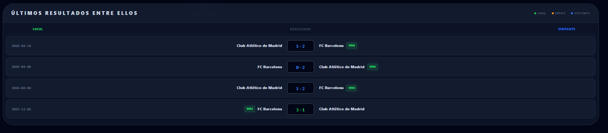


### F7. Consulta de información básica de un equipo:

Permite visualizar información detallada de uno de los equipos seleccionados tras seleccionar la competición a la que pertenece. Muestra información general del club como el estadio, el año de fundación, colores con los que juega, página web del club, ubicación de la sede/estadio y el nombre la plantilla de sus jugadores.

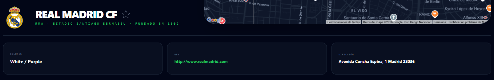
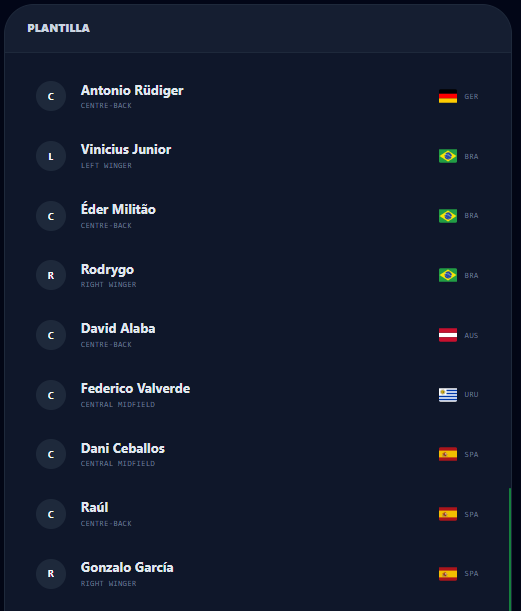


### F8. Consulta de la ubicación exacta de la sede/estadio

Basándonos en la información básica utilizamos dos APIs para mostrar la dirección indicada en texto a través de un mapa interactivo que nos permite ver exactamente dónde se encuentra la localización de la sede/estadio del club específico.

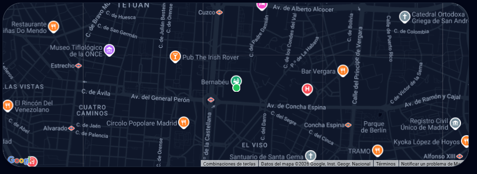


### F9. Consulta de los últimos 10 resultados de un equipo

En la vista de Análisis Avanzado tras analizar los datos del mismo, se muestra los últimos 10 resultados del equipo seleccionado unicamente en las competiciones que mostramos en la web.

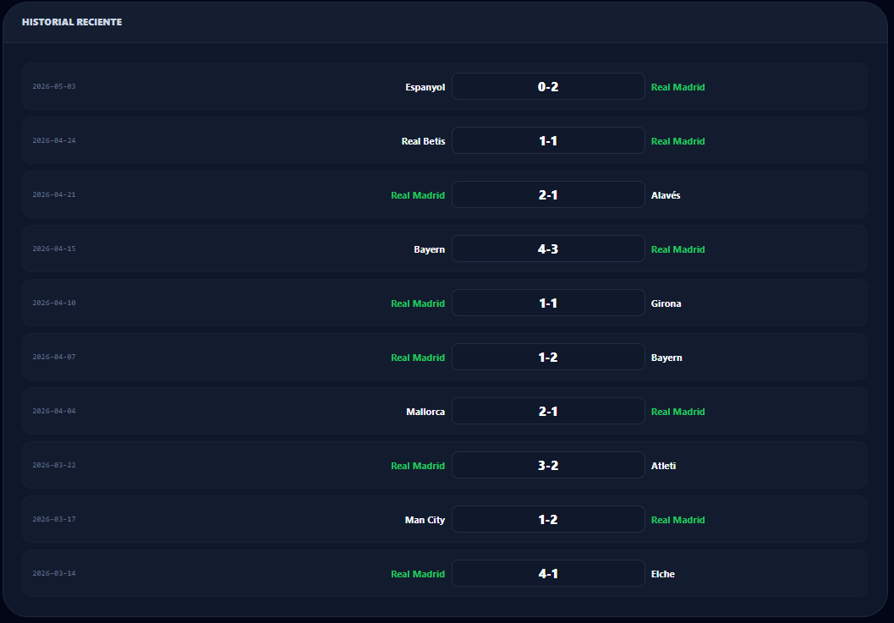


### F10. Consulta de la posición actual de la clasificación de un equipo en la competición seleccionada

En la misma vista que las dos funcionalidades anteriores, se muestra una clasificación actualizada de la competición seleccionada, incluyendo datos como puntos y goles entre otros. El equipo analizado aparece resaltado en color verde para facilitar la identificación de su posición en la tabla y sus estadísticas dentro de dicha competición.

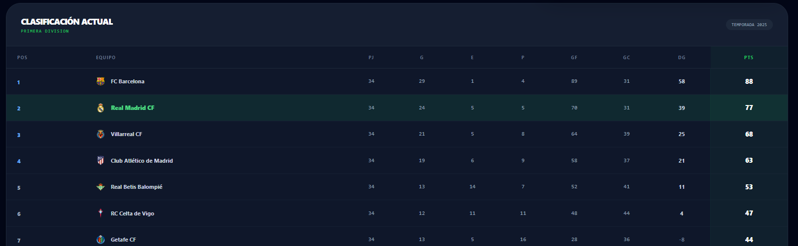


### F11. Consulta de máximos goleadores de una competición

Tras la selección de la competición, en la vista de Rendimiento Individual mostramos los máximos goleadores de la misma.

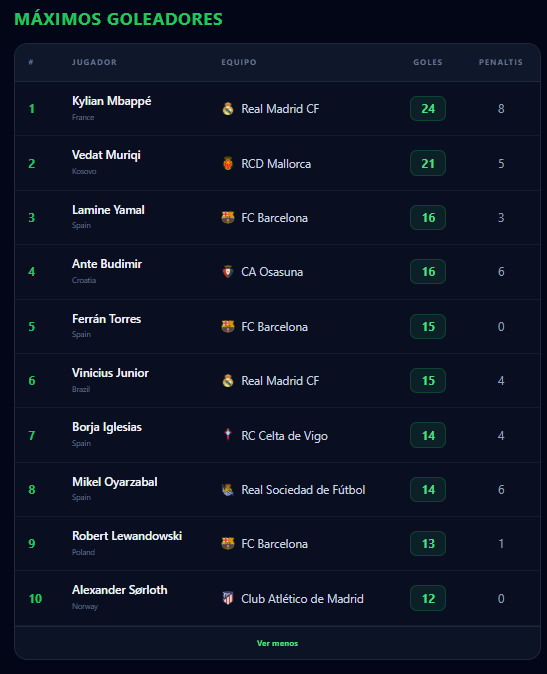


### F12. Consulta de máximos asistentes de una competición

Tras la selección de la competición, en la vista de Rendimiento Individual mostramos los máximos asistentes de la misma.

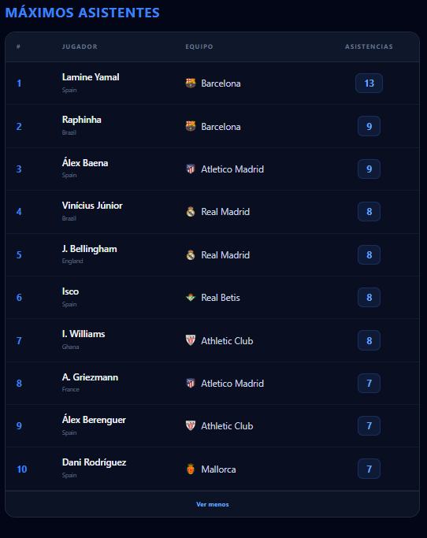


### F13. Consulta de máximos infractores de una competición

Tras la selección de la competición, en la vista de Rendimiento Individual mostramos los máximos infractores (sumando el número de tarjetas amarillas + rojas) de la misma.

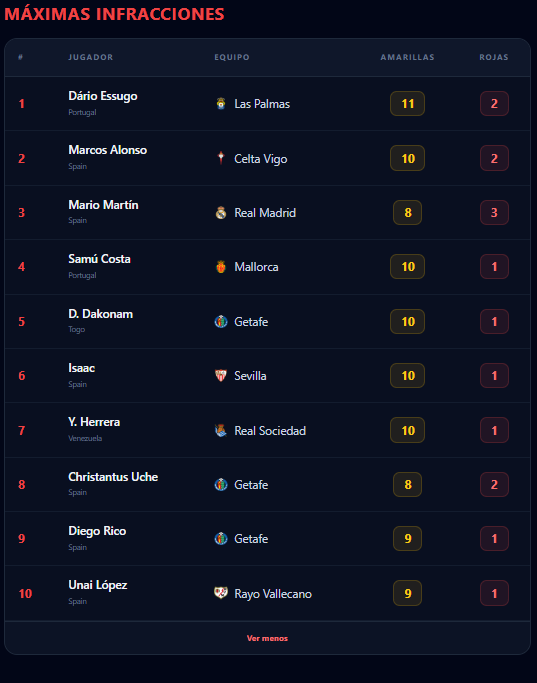

### F14. Consulta de la clasificación acual en la competición seleccionada

En la vista de Rendimiento Individual tras mostrar rankings individuales de jugadores, se muestra una clasificación de dicha competición con sus datos.

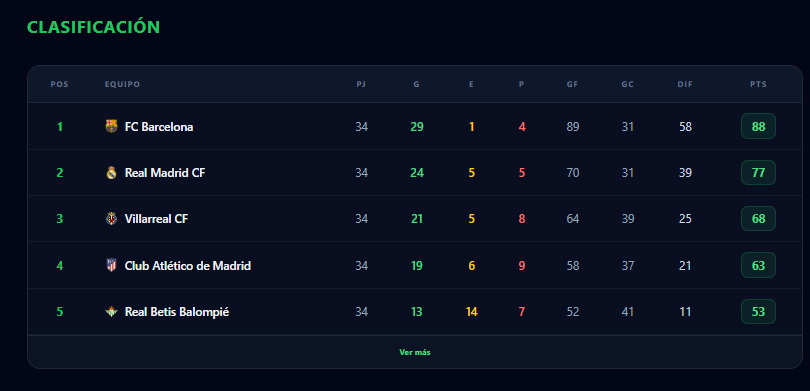


### F15. Consulta de los datos de un jugador de un equipo

En la vista de Datos Jugador, se puede obtener información de cualquier jugador (buscador derecho) de cualquier equipo (dropdown izquierdo) de la liga seleccionada

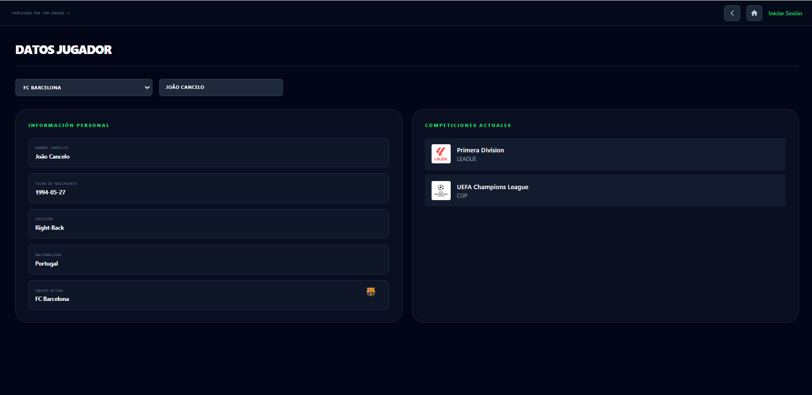


### F16. Consulta de resultados de partidos anteriores y fechas de próximos partidos 

En la vista de Partidos nos aparecerán los partidos de la jornada actual o más próxima al momento actual, mostrando resultado u horario si no de disputó el encuentro todavía. También se podrá seleccionar la jornada y temporada concreta que se desee consultar.

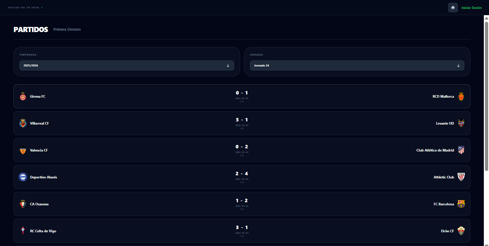

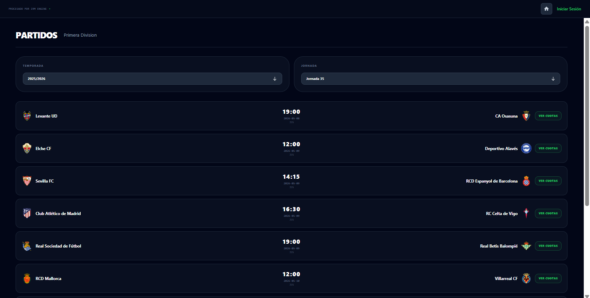


### F17. Consulta de cuotas deportivas para futuros partidos 

Si en un partido concreto se selecciona el botón de ver cuotas, aparecerá un cuadro con información de las cuotas para ese partido concreto

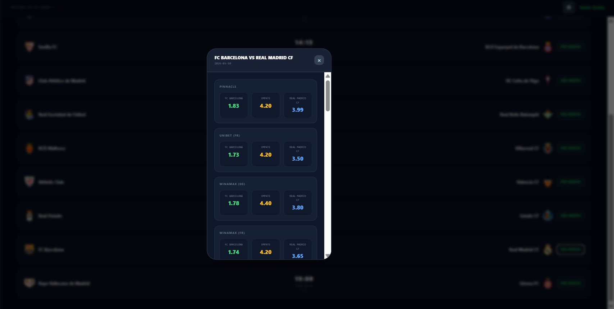

### F18. Iniciar sesión

Si en cualquier vista, en la parte superior derecha, seleccionamos en "Iniciar Sesión", nos llevará a la vista de Inicio de Sesión, donde podremos introducir nuestras credenciales, correo o usuario y contraseña.

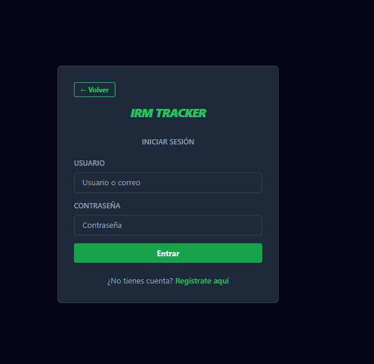

Una vez iniciada la sesión, en la parte superior derecha ahora se nos indicará nuestro usuario y si interaccionamos con este aparecerán las siguientes opciones

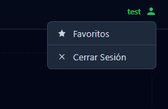


### F19. Registrarse con una nueva cuenta

Si en la vista de Inicio de Sesión, seleccionamos "Registrarse aquí" nos llevará a la vista de Registro, la cual permite crear una nueva cuenta introduciendo los campos usuario, correo electrónico y la contraseña con su confirmación.

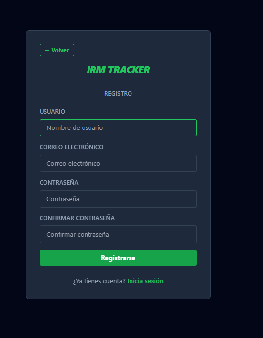

### F20. Agregar un equipo como favorito del usuario actual

Si previamente iniciamos sesión con una cuenta, se nos permite marcar un icono de estrella en la vista de Análisis Avanzado.

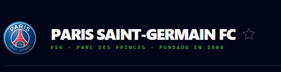

De esta manera se marca el equipo como favorito.

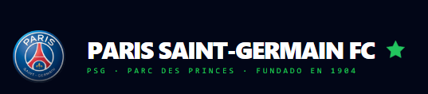

Una vez marcado, se podrá acceder a la sección de favoritos de la cuenta para consultar el equipo o eliminarlo de favoritos.

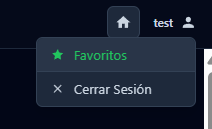

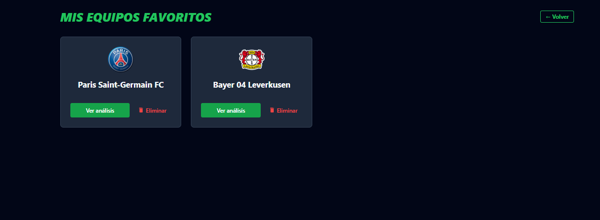


---

## Integrantes Grupos
- Ismael Brea Arias <ismael.brea@udc.es>
- Rubén González Ouzounis <ruben.gonzalez.ouzounis@udc.es>
- Manuel Valiña Pérez  <manuel.valina.perez@udc.es>

---

## Cómo ejecutar
### Prerrequisitos y máquina(s) de desarrollo/prueba:
- Sistema Operativo: Ubuntu 24.04 // Arch Linux // fedora // WSL // macOS
- Versión de Docker: 1:28.0.1-1
- Cualquier otra información de relevancia

### Secuencia de comandos (docker) para descargar y lanzar la aplicación:
**Paso 1:** 

Clonar este repositorio de GitHub y cambiarnos a su carpeta principal
``` bash
git clone <>
cd pi2526-irm2526
```

**Paso 2:** Una vez dentro ejecutar el siguiente comando de docker. IMPORTANTE: copiar antes el .env a la carpeta raíz del proyecto (al nivel del Dockerfile). Una vez hecho eso ejecutar:
bash
docker build -t irm .


*Paso 3:* Finalmente, ejecutar el contenedor creado con:
bash
docker run -it -p 8000:8000 irm


**Paso 4:** 

Acceder a http://127.0.0.1:8000/ para visualizar la aplicación

- docker run --rm -it -v /var/lib/docker:/docker -v ~/volume-backup/docker/volumes:/volume-backup alpine:edge cp -r /volume-backup/data-vol /docker/volumes
- [...]

---


## Problemas conocidos

- Nuestras cuentas (e IPs) de la API API-FOOTBALL están baneadas, si la key del .env está suspendida habría que usar otra de otra cuenta.
- Lorem
- Ipsum

(if any)

---